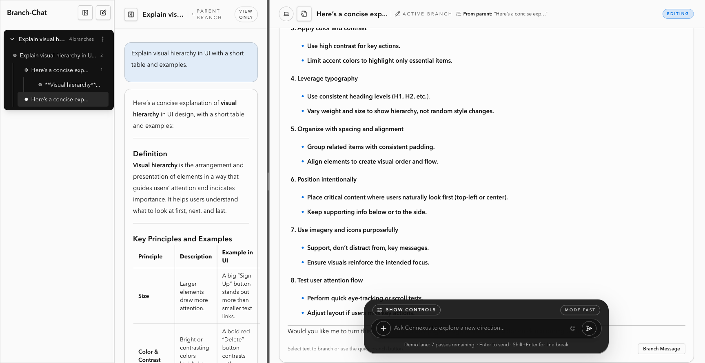

# Branch Chat

Branch Chat is a server-first, non-linear branching chat app built with RedwoodSDK React Server Components (RSC) on Cloudflare Workers.

The project is designed around branchable conversations, Durable Object persistence, and server-owned chat orchestration.

## Demo Video

[](./public/branch-chat-demo.mp4)

Click the preview image to open the GitHub video player.

## Documentation

- Architecture: [`Docs/architecture.md`](Docs/architecture.md)
- Local setup: [`Docs/setup.md`](Docs/setup.md)
- Environment variables and bindings: [`Docs/env-vars.md`](Docs/env-vars.md)
- Contributing: [`CONTRIBUTING.md`](CONTRIBUTING.md)
- Security policy: [`SECURITY.md`](SECURITY.md)

## Core Architecture

- Routing and rendering use RedwoodSDK primitives in `src/worker.tsx` (`defineApp`, `route`, `render`).
- Conversation graph state persists in Cloudflare Durable Objects:
  - `ConversationStoreDO` (per-conversation graph + messages)
  - `ConversationDirectoryDO` (conversation list metadata)
  - `AccountDO` (per-user quota + BYOK metadata)
- Mutations run through server functions in `src/app/pages/conversation/functions.ts` (`"use server"`).
- Client islands in `src/app/components/**` handle interaction-only concerns (pane resizing, keyboard shortcuts, optimistic UI).

## Quick Start

1. Install dependencies:
   ```bash
   pnpm install
   ```
2. Copy local env template:
   ```bash
   cp .dev.vars.example .dev.vars
   ```
3. Add required keys in `.dev.vars` (at minimum `OPENAI_API_KEY`).
4. Start local development:
   ```bash
   pnpm dev
   ```
5. Open [http://localhost:5174](http://localhost:5174).

## Scripts

- `pnpm dev`: Start Vite + RedwoodSDK dev server.
- `pnpm types`: Run TypeScript type checking.
- `npm run test`: Run Node's test runner (`node --test`).
- `npm run lint`: Run TypeScript checks as the current lint gate.
- `pnpm release`: Build and deploy with Wrangler.

## License

This project is licensed under the MIT License. See [`LICENSE`](LICENSE).
